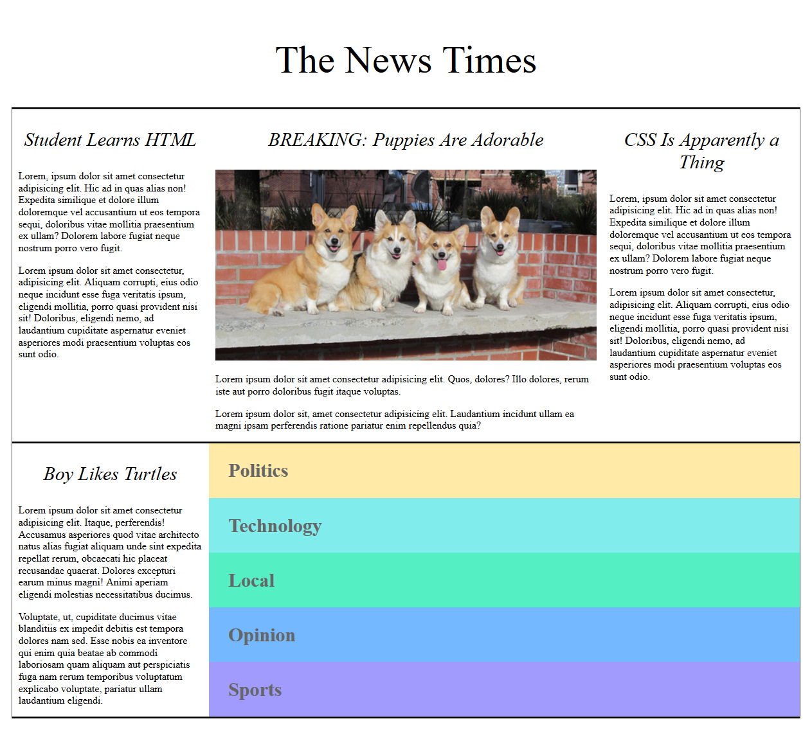
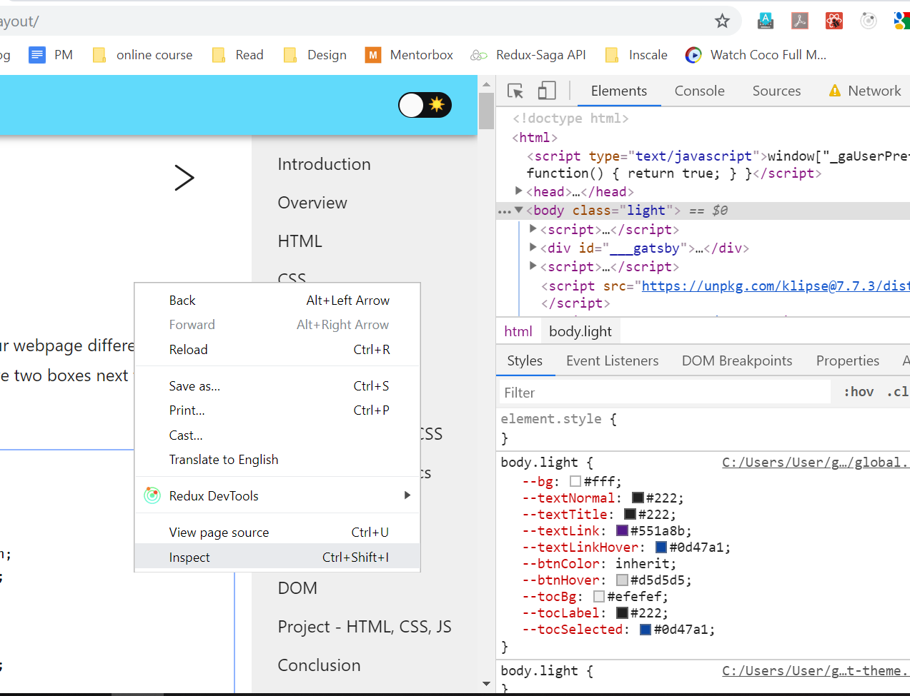

# Project - HTML & CSS

As I've said in the beginning, programming is like learning language, you need to practice it for you to grasp it.

This is a take-home project that allows you to get your hand dirty to apply the HTML and CSS knowledge that you've learnt so far.

We're going to make a news site together, and the project would looks like this:



The goal is not to create a exact copy, but to use what you've learnt to achieve something almost similar.

- The image uses a special URL: [http://placecorgi.com/500/250][placecorgi], which allows us to generate random picture of cute Corgi.

[Here is a complete version][project-complete-version]

## Project Setup

1.  To create your project, create an empty folder and name it anything you like, e.g. `my-first-project`.
1.  Create a file that ends with `.html`, e.g. `news.html`. You probably need to enable show file extension for your laptop. See [here][windows-file-extensions] to learn how to do that in Windows.
1.  Fill up the content with the basic HTML template. You can generate the same in VS Code if you type `html:5` and then press [Tab].

    ```html
    <!DOCTYPE html>
    <html lang="en">
      <head>
        <meta charset="UTF-8" />
        <meta name="viewport" content="width=device-width, initial-scale=1.0" />
        <meta http-equiv="X-UA-Compatible" content="ie=edge" />
        <title>Document</title>
      </head>
      <body>
        <!-- Your content here -->
      </body>
    </html>
    ```

1.  Create a `styles.css` file next to your html file.
1.  Add the following html tag within your html `<head>` tag. This is how you add a CSS file instead of putting all of them within `<style>` tag.

    ```html
    <link rel="stylesheet" href="./styles.css" />
    ```

1.  Right click your html file and choose "Open with..." and pick your browser, now the html should be shown in your browser.
1.  Everytime you change your HTML/CSS file, you need to refresh the browser to see the changes.

## Using Browser DevTools

One of the most useful tricks to learn and debug HTML and CSS is to check them in the browser directly. Right click on any element in the webpage and click "Inspect Element", all the HTML and CSS are shown to you and you can tweak them directly to see the effect.



The great thing about Browser DevTools is that you can use it to inspect _all_ websites. So if you see some very nice styles/elements on any website, you can just use Browser DevTools to "steal" it.

## Tips to Complete the Project

1. Google everything. That's what any web developer do. There are few resources that I want to highlight:
   - [MDN]: this is maintained by Mozilla, the creator of Firefox browser. The info there are accurate, and it's explained very clearly. You can trust the information there.
   - [css-tricks]: a website with insightful articles on HTML and CSS
   - [stack-overflow]: a Q&A website where programmer post questions and get answers from others. Sometimes you may see people post your exact question, and there is answer that you can directly use it your project. Try it in your project and see if that works, that's totally fine. However, spend some time to understand the code you paste into your project afterwards because sometimes the answer may be outdated or is actually bad practice.
1. Take it one step at a time. Complete from top to bottom.
1. The complete site code is not the "correct" answer. That's like saying there is a correct answer to write an essay.

[placecorgi]: http://placecorgi.com/500/250
[project-complete-version]: https://btholt.github.io/intro-to-web-dev-v2/news.html
[windows-file-extensions]: https://www.thewindowsclub.com/show-file-extensions-in-windows
[mdn]: https://developer.mozilla.org/en-US/
[css-tricks]: https://css-tricks.com/
[stack-overflow]: https://stackoverflow.com/
