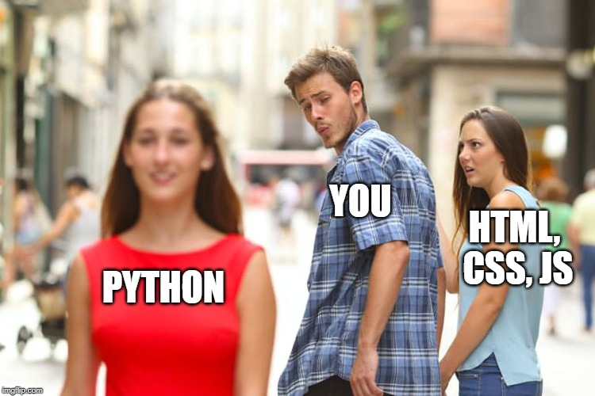

# Conclusion

Congratulations on made it through this workshop!

If you feel there is too much information to absorb and your brain is not working now, it's expected. I've just pour a lot information to you today that people use a week to learn.

Give yourself some time, keep learning. You will feel more confident as time goes.

## Final takeaways

1. Google, Google, Google. That's part of the job.
1. If you're stuck, take a rest and walk around, or continue tomorrow. Programming is a cycle of feeling like an idiot and feeling like the smartest guy in the world. Don't let either feeling go over your head.

   

1. If something interest you then you can keep learning about it. Go deep into it. That's the fun of programming.

   

1. Don't compare yourself to others. Programming is a field that keep changing, it means the knowledge totally change every few years, and nobody can keep themselves updated of all the changes. It means there are a lot opportunities for everyone.

## Next steps

1. Finish the projects. You can ask me questions in the meetup or just message me. I won't give you answer but probably will share you the page for you to read.
1. [Javascript 30][javascript-30] - build 30 projects in 30 days. Fun stuff.
1. [freeCodeCamp] - thousands of coding lessons and totally free
1. [CS50] - if you want to go back and learn the computer science fundamentals. This is a free course by Harvard University.
1. Join [#100DaysOfCode][100-days-of-code]
1. Build something that interest you, e.g. your personal website, your own to-do app, etc. Some inspirations:
   - [Paint](https://jspaint.app)
   - [Winamp](https://webamp.org/)
   - [Windows XP](https://winxp.now.sh/)
   - [purecss-francine](http://diana-adrianne.com/purecss-francine/)

<h1 align="center"> The End </h1>

[javascript-30]: https://javascript30.com/
[freecodecamp]: https://www.freecodecamp.org/
[cs50]: https://www.edx.org/course/cs50s-introduction-to-computer-science
[100-days-of-code]: https://www.100daysofcode.com/
